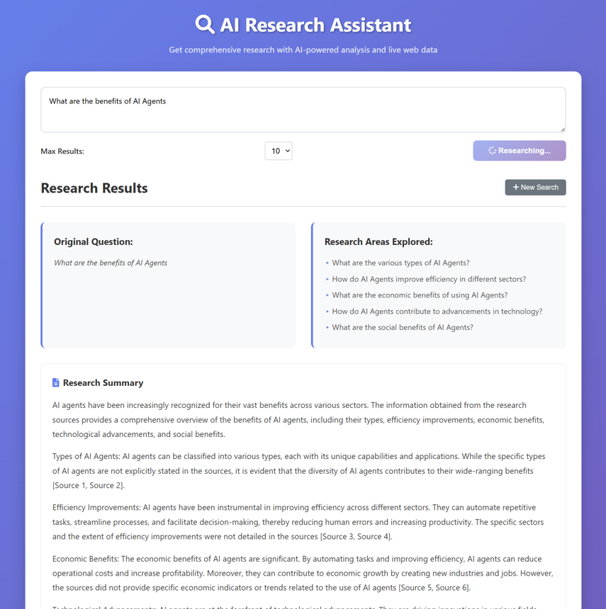

# AI Research Assistant

An AI-powered web application that conducts comprehensive research by breaking down questions into sub-topics, searching the web for information, and generating detailed reports with citations.



## Features

- **AI-Powered Question Breakdown**: Uses OpenAI GPT-4 to intelligently break research questions into focused sub-questions
- **Live Web Search**: Uses DuckDuckGo and Google search with fallback to gather real-time information from the web
- **Comprehensive Summarization**: Generates detailed research reports with proper citations
- **Vector Database Storage**: Uses ChromaDB for storing and retrieving research results
- **Modern UI**: Clean, responsive interface with real-time loading animations
- **FastAPI Backend**: High-performance Python backend with async support
- **No API Key Required for Search**: Works without SerpAPI - uses web scraping with intelligent fallbacks

## Prerequisites

- Python 3.8 or higher
- OpenAI API key (only requirement!)

## Installation

1. **Clone or download the project**

   ```bash
   cd "AI Research Assistant Agent"
   ```
2. **Install Python dependencies**

   ```bash
   pip install -r requirements.txt
   ```
3. **Set up environment variables**

   ```bash
   cp .env.example .env
   ```

   Edit the `.env` file and add your API key:

   ```
   OPENAI_API_KEY=your_openai_api_key_here
   ```

## Getting API Key

### OpenAI API Key

1. Go to [OpenAI API](https://platform.openai.com/)
2. Sign up or log in to your account
3. Navigate to API Keys section
4. Create a new API key
5. Copy the key to your `.env` file

**Note**: No SerpAPI key needed! The application uses free web scraping with intelligent fallbacks.

## Running the Application

### **Recommended Method (Windows-friendly):**

```bash
python start_server.py
```

This will automatically find a free port and start the server without permission issues.

### **Alternative Methods:**

1. **Using the quick start script:**

   ```bash
   python run.py
   ```
2. **Manual startup:**

   ```bash
   cd backend
   python main.py
   ```
3. **Using uvicorn directly:**

   ```bash
   uvicorn backend.main:app --host 127.0.0.1 --port 8888
   ```

**Open your browser and navigate to the URL shown in the terminal (usually `http://localhost:8888`)**

## How to Use

1. **Enter Your Research Question**

   - Type a comprehensive research question in the text area
   - Example: "What are the economic impacts of climate change in Africa?"
2. **Configure Search Settings**

   - Select the maximum number of search results (10, 20, or 30)
   - More results = more comprehensive research but longer processing time
3. **Start Research**

   - Click "Start Research" to begin the AI-powered research process
   - Watch the real-time progress indicators
4. **View Results**

   - Review the original question and sub-questions explored
   - Read the comprehensive research summary
   - Check sources and citations for further reading

## API Endpoints

- `GET /` - Serves the frontend HTML page
- `POST /api/research` - Conducts research for a given question
- `GET /api/health` - Health check endpoint

### Research API Request Format

```json
{
  "question": "Your research question here",
  "max_results": 10
}
```

## Development

### Adding New Features

1. Backend changes go in `backend/services/research_agent.py`
2. Frontend changes go in `frontend/static/`
3. API endpoints are defined in `backend/main.py`

### Testing

- Test the API health endpoint: `curl http://localhost:8888/api/health`
- Use browser developer tools to debug frontend issues
- Check server logs for backend errors

## License

This project is open source and available under the MIT License.

## Support

For issues and questions:

1. Check the troubleshooting section above
2. Review the browser console and server logs
3. Ensure all API keys are valid and have sufficient credits

## Contributing

Contributions are welcome! Please feel free to submit pull requests or open issues for bugs and feature requests.
